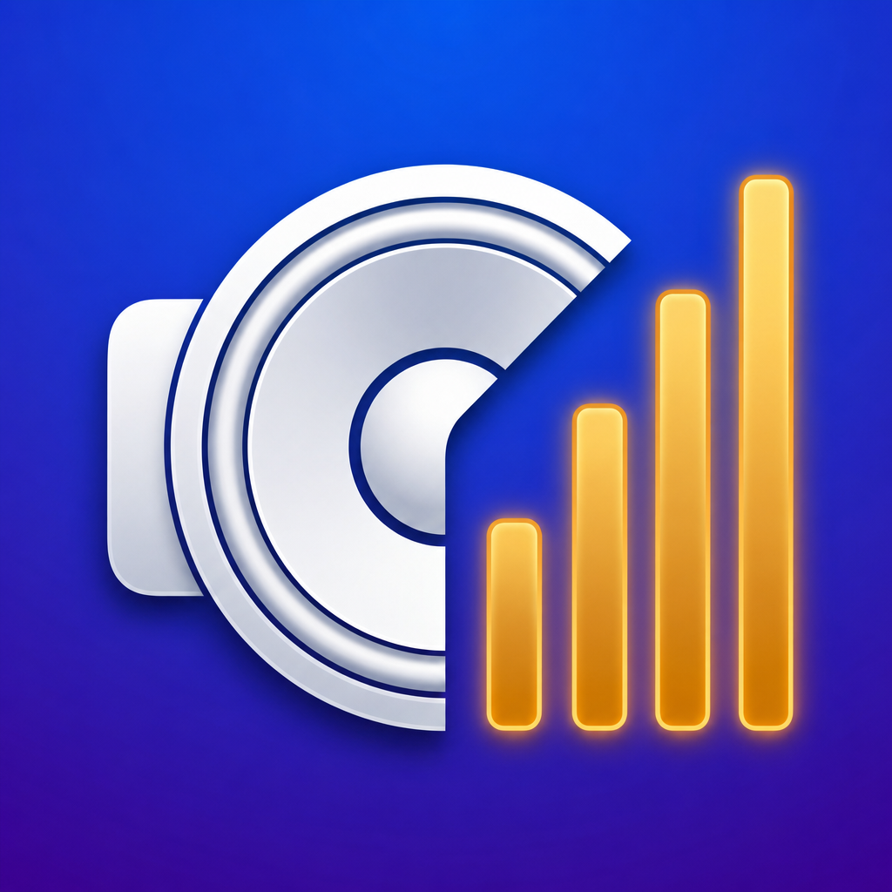
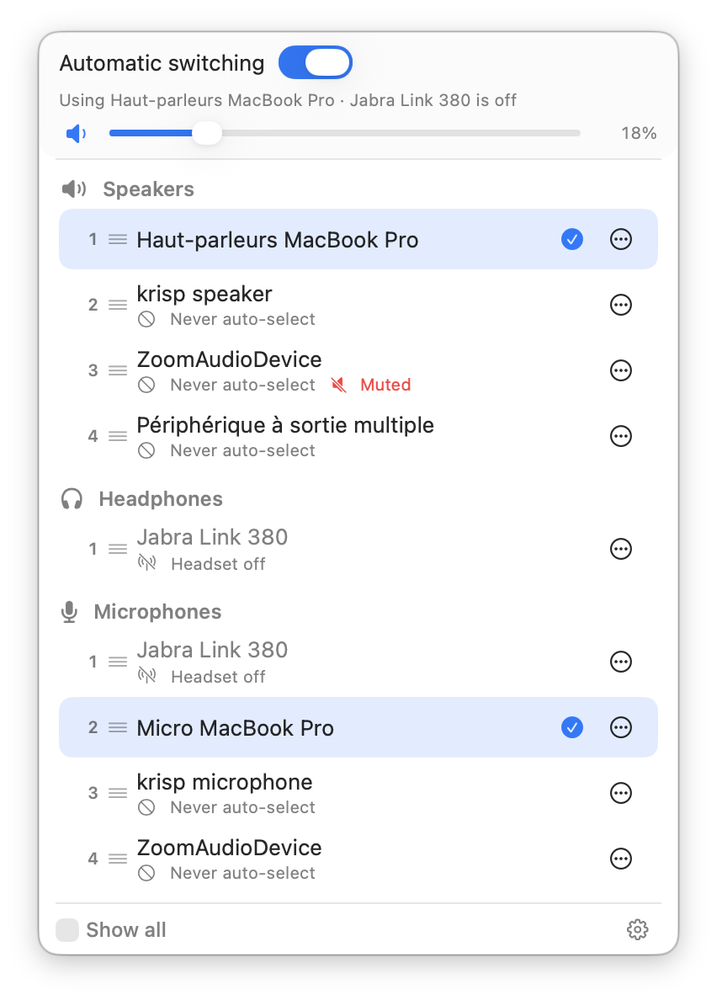
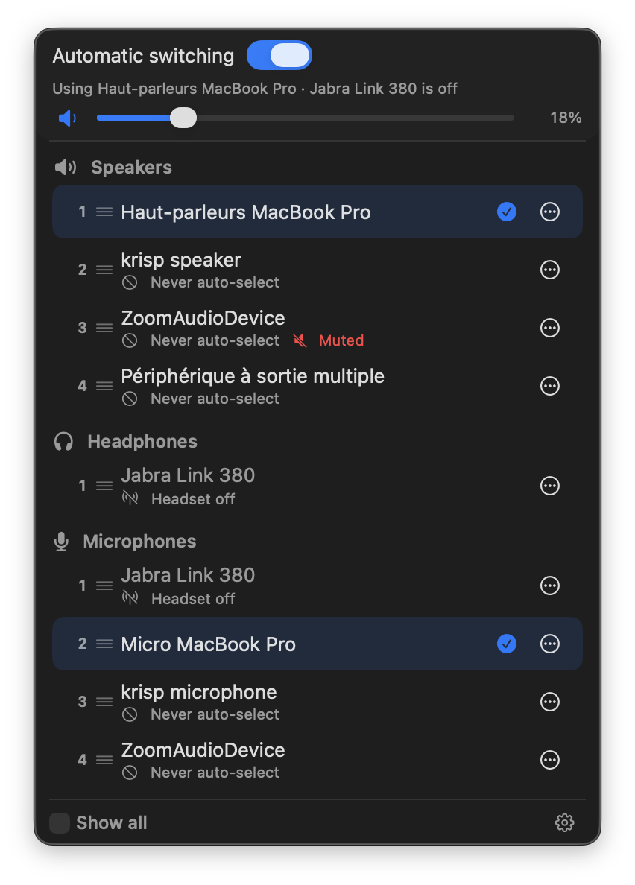

# Audio Priority Bar

<p align="center">
  
</p>

A native macOS menu bar app that automatically switches to your
highest-priority connected headphones, speakers, and microphone.


<p align="center">
  
  
</p>

## Features

- Automatic switching prefers your top available headphones, then speakers
- Persistent Speakers, Headphones, and Microphones priority lists
- One-click manual override from the app or macOS Sound Settings
- Volume control by slider or scroll wheel, with mute and availability status
- Drag ordering within lists and between output lists, with forbidden-drop feedback
- Per-list visibility controls, Never Auto-Select, and remembered devices
- Optional microphone switching with a matching physical USB output
- Settings, right-click quick actions, VoiceOver support, and Open at Login
- Jabra Link 380 and 390 headset power-off detection

## Install

Requires macOS 14 Sonoma or later. Releases are universal for Apple silicon
and Intel Macs.

### Homebrew

```bash
brew install --cask camguillory/tap/audio-priority-bar
```

The fully qualified command trusts only this cask, not every current and future
item in the tap.

### Direct download

Download `AudioPriorityBar.zip` and `AudioPriorityBar.zip.sha256` from the
[latest release](https://github.com/camguillory/Audio-Priority-Bar/releases/latest)
into the same folder. Verify the archive before unzipping it:

```bash
cd ~/Downloads
shasum -a 256 -c AudioPriorityBar.zip.sha256
```

Move `AudioPriorityBar.app` to `/Applications`.

### Gatekeeper

Audio Priority Bar is ad-hoc signed, not signed with an Apple Developer ID or
notarized. If macOS blocks the first launch, open
**System Settings > Privacy & Security** and click **Open Anyway**.

Advanced users may instead remove only this app's quarantine attribute:

```bash
xattr -d com.apple.quarantine /Applications/AudioPriorityBar.app
```

### Build from source

```bash
git clone https://github.com/camguillory/Audio-Priority-Bar.git
cd Audio-Priority-Bar
./build.sh
```

The universal, ad-hoc-signed app is written to `dist/AudioPriorityBar.app`.
You can also open `AudioPriorityBar.xcodeproj` in Xcode and build with Command-R.

## Use

### Automatic and manual switching

- Automatic switching uses the first available headphone, then the first speaker.
- Selecting a device in the panel or macOS Sound Settings turns automatic
  switching off so that choice stays active.
- Turn automatic switching back on to resume priority-based selection.
- With **Move microphone with output** enabled, matching input and output
  halves of a physical USB headset switch together.

Speakers, Headphones, and Microphones remain visible in both modes.

### Device controls

- Drag outputs within or between Speakers and Headphones.
- Reorder microphones within Microphones.
- Use each row's actions menu for keyboard-accessible Move Up, Move Down, and
  Move to commands.
- Exclude a device from one output list or both, or keep it visible while
  preventing automatic selection.
- Use **Show all** to manage excluded and disconnected remembered devices.
- Forget a disconnected device to remove its saved settings.

### Jabra Link monitoring

Jabra Link dongles remain visible to CoreAudio when their wireless headset is
powered off. Audio Priority Bar reads the dongle's HID link state and falls
back to the next usable device after a short debounce.

Link 380 behavior is locally hardware-verified. Link 390 support uses the
hardware measurements from
[tobi/AudioPriorityBar#32](https://github.com/tobi/AudioPriorityBar/pull/32);
it has not been locally verified for this release. If monitoring is unreadable
or cannot start, the app fails open and leaves the device selectable.

macOS may request **Input Monitoring** permission. Open at Login may separately
require approval in **System Settings > General > Login Items**.

### Upgrading from V1

V2 keeps the newer `app.audioprioritybar` bundle identifier and imports
recognized settings once from the public V1 identifier
`com.example.AudioPriorityBar`. Existing V2 settings take precedence. Because
the bundle identity changed, macOS may ask you to approve Input Monitoring or
Open at Login again.

## Contributing

Issues and pull requests are welcome. `main` reflects the latest release;
`develop` is the next version in progress.

For anything substantial, open an issue first so the approach can be agreed
before you spend time on it.

- Work from a fork rather than pushing to this repository.
- Branch from `develop` and open the pull request against `develop`. GitHub
  bases new pull requests on `main`, so switch it before submitting.
- Every pull request runs both Swift Testing suites and a universal build.
- Releases are tagged and published manually.

## License

[MIT License](LICENSE)

## Acknowledgments

Originally created by [tobi](https://github.com/tobi).

Built with SwiftUI, AppKit, CoreAudio, and IOKit.
