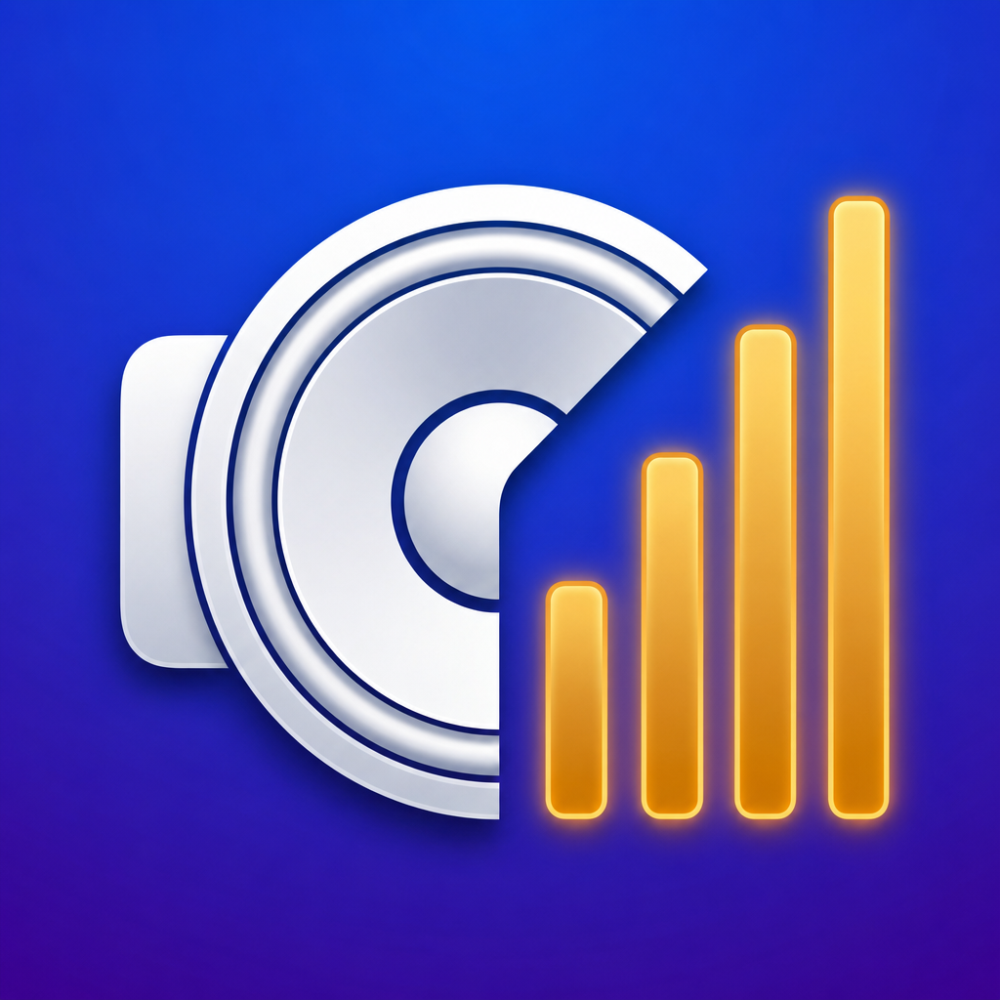
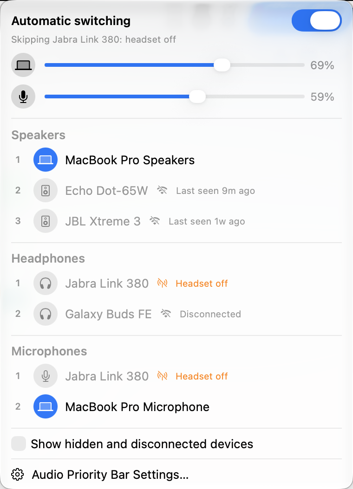

<p align="center">
  
</p>

<h1 align="center">Audio Priority Bar</h1>

<p align="center">
  Rank your headphones, speakers, and microphones once.<br>
  Your Mac uses the best one that's connected.
</p>

<p align="center">
  <a href="https://github.com/camguillory/Audio-Priority-Bar/releases/latest/download/AudioPriorityBar.zip"></a>
</p>

<p align="center">
  <a href="https://github.com/camguillory/Audio-Priority-Bar/releases/latest"></a>
  
  <a href="LICENSE"></a>
</p>

<p align="center">
  
</p>

## Why

| When | macOS on its own | Audio Priority Bar |
| --- | --- | --- |
| A display connects | Sound can move to its speakers | Sound stays on your top device |
| AirPods take over on their own | They keep the sound | It switches back to your choice |
| You mute your microphone | In each app | Once, for every app |

## Highlights

- **Switches for you.** Headphones first, then speakers, and your top microphone.
- **Tells you.** A brief notice under the menu bar icon names the device it just picked.
- **Mute from anywhere.** <kbd>⌥</kbd> <kbd>⇧</kbd> <kbd>M</kbd> in any app, or from Shortcuts, Raycast, or a Stream Deck. The menu bar icon turns red while muted.
- **Bluetooth in one click.** Connect and disconnect paired speakers and headphones from the panel.
- **Battery at a glance.** AirPods buds and case, and Jabra headsets on a Link dongle.
- **Native.** Laid out like the macOS Sound menu, with Liquid Glass on macOS 26, VoiceOver support, and automatic updates.

## Install

```bash
brew install --cask camguillory/tap/audio-priority-bar
```

Or [download the app](https://github.com/camguillory/Audio-Priority-Bar/releases/latest/download/AudioPriorityBar.zip),
unzip it, and move `AudioPriorityBar.app` to `/Applications`. Requires macOS 14
Sonoma or later, on Apple silicon or Intel.

> [!NOTE]
> Audio Priority Bar is signed with its own certificate, not an Apple Developer
> ID, and it isn't notarized. If macOS blocks the first launch, open
> **System Settings > Privacy & Security** and click **Open Anyway**.

<details>
<summary>Verify the download</summary>

Download `AudioPriorityBar.zip.sha256` from the
[latest release](https://github.com/camguillory/Audio-Priority-Bar/releases/latest)
into the same folder as the archive, and check it before unzipping:

```bash
cd ~/Downloads
shasum -a 256 -c AudioPriorityBar.zip.sha256
```

</details>

<details>
<summary>Remove the quarantine attribute instead</summary>

Advanced users may instead remove only this app's quarantine attribute:

```bash
xattr -d com.apple.quarantine /Applications/AudioPriorityBar.app
```

</details>

<details>
<summary>Upgrading from V1</summary>

V2 imports V1 settings once on first launch (existing V2 values win). The new
bundle identifier may require re-approving Input Monitoring or Open at Login.

</details>

## Use

Click the icon in the menu bar to open the panel. Drag devices to rank them;
the active one is highlighted. Picking a device by hand turns automatic
switching off until you turn it back on.

<p align="center">
  <picture>
    <source media="(prefers-color-scheme: dark)" srcset="screenshot-dark.png">
    
  </picture>
</p>

<details>
<summary>How switching works</summary>

- Automatic switching uses the first available headphone, then the first speaker.
- Selecting a device in the panel turns automatic switching off so that
  choice stays active. Turn automatic switching back on to resume
  priority-based selection.
- A device you pick in Control Center or Sound Settings stays until a device
  next connects or disconnects, and automatic switching stays on.
- When macOS or another app changes the device on its own, as AirPods do when
  you put them in, Audio Priority Bar switches back: to your list with
  automatic switching on, or to the device you picked with it off. A device
  you connect still takes over.
- If macOS takes the device again right after a switch back, as AirPods in
  your ears can, Audio Priority Bar leaves it and names it in the panel.
  **Fix in Settings** opens the AirPods settings, where choosing **When Last
  Connected to This Mac** under **Connect to This Mac** stops them switching
  on their own.
- With **Select headset input and output together** enabled, choosing
  either half of a physical USB headset selects the other too.
- With **Mute speakers when headphones disconnect** enabled, the speakers
  start muted when the headphones playing disconnect, are turned off or run
  out of battery.
- The microphone mute follows automatic switching to the next microphone,
  and quitting the app restores it.

Speakers, Headphones, and Microphones remain visible in both modes.

</details>

<details>
<summary>Device controls</summary>

- Drag outputs within or between Speakers and Headphones.
- Reorder microphones within Microphones.
- Use each row's actions menu for keyboard-accessible Move Up, Move Down, and
  Move to commands. Right-click a row to open the same menu.
- Hide a device to remove it from Speakers, Headphones, or Microphones, or
  keep it visible while blocking automatic selection with **Never
  Auto-Select**.
- Use **Show hidden and disconnected devices** to manage hidden and
  disconnected remembered devices.
- Forget a disconnected device to remove its saved settings.
- Paired Bluetooth speakers and headphones stay listed at their rank while
  they are off, dimmed. Click one to connect it, and automatic switching
  treats it like any device that just connected. Hide one you never use to
  take it off the list.
- A Bluetooth device that is connected but not in use shows **Connected**.
  Hover it and click **Disconnect** to release it.
- A device with a paired counterpart, like a USB headset's input and output
  halves, shows an override for the current default: **Mic only** or
  **Output only** while **Select headset input and output together** is on,
  or **Use both** while it's off. It appears only when picking it would
  change something.
- Set the output volume and microphone level by slider or scroll wheel. Click
  the round icon beside a slider to mute; it turns red while muted.
- Speakers and headphones are sorted by what each device reports, in any
  system language.

New HDMI and DisplayPort outputs start hidden; showing one is permanent, and
**Hide new HDMI and DisplayPort outputs** turns this off for future devices.
The active device always stays listed, even when hidden.

</details>

<details>
<summary>Menu bar icon</summary>

- The icon shows the current output, like AirPods or headphones, and
  optionally the microphone, labeled in and out if you like. Unlabeled, a mic
  that belongs to the output, like the AirPods mic, shares its icon.
- It can be outlined in Settings to tell it apart from the Sound icon, and can
  show the volume level beside any device icon. Settings previews the icon as
  you change it.
- A muted microphone shows in red and pulses, unless you turn the pulse off in
  Settings.
- Hovering the icon shows the current output and microphone.
- Option-click the icon to mute the microphone. Right-click it to mute the
  microphone, or for Settings, Check for Updates, and Quit.
- A **Microphone muted** reminder appears when an app starts recording while
  you are muted. Click it to hide it until you next record while muted. It
  and the switch notices can each be turned off in Settings.

</details>

<details>
<summary>Jabra Link headsets</summary>

The app asks a Jabra Link dongle directly whether its wireless headset is
powered off, since CoreAudio can't tell, and falls back automatically in
under a second. Right after replugging, it briefly shows the headset as off
while the wireless link re-establishes, which is expected, not a bug.

Link 380 is hardware-verified. Link 390 uses the same detection but is
unverified on hardware
([details](https://github.com/tobi/AudioPriorityBar/pull/32)). An
unrecognised dongle fails open rather than being treated as off.

</details>

### Automation

Three URLs control the microphone mute from Shortcuts, Raycast, a Stream Deck,
or Terminal:

```bash
open "audioprioritybar://toggle-mic-mute"
open "audioprioritybar://mute-mic"
open "audioprioritybar://unmute-mic"
```

In Shortcuts, add an **Open URLs** action with one of them. The app opens if it
isn't running. Any other form of the URL is ignored. The Shortcuts tab in
Settings lists them with a Copy button.

### Permissions

| Permission | When it's asked |
| --- | --- |
| Bluetooth | The first time you connect or disconnect a device from the panel |
| Input Monitoring | May be asked, to tell when a Jabra Link headset is off |
| Accessibility | Optional, only from Settings, to keep the hover preview off while macOS hides the icon |
| Login Items | Open at Login may need approval in **System Settings > General > Login Items**, which Settings opens for you |

The mute shortcut needs no permission.

## Contributing

Issues and pull requests are welcome. Open an issue first for anything
substantial, then branch from `develop` and open the pull request against
`develop`. See [CONTRIBUTING.md](CONTRIBUTING.md).

### Build from source

```bash
git clone https://github.com/camguillory/Audio-Priority-Bar.git
cd Audio-Priority-Bar
./build.sh
```

The universal app is written to `dist/AudioPriorityBar.app`, signed with the
release certificate when it is in your keychain and ad-hoc otherwise.
You can also open `AudioPriorityBar.xcodeproj` in Xcode and build with Command-R.

For local development, `./build.sh --dev` builds only your machine's
architecture in the Debug configuration, which is much faster, and writes
`dist/AudioPriorityBar-dev.app`, signed the same way.

## License

[MIT License](LICENSE)

## Acknowledgments

Originally created by [tobi](https://github.com/tobi).

The Jabra GNP framing and pairing-record query are based on
[jabridge](https://github.com/Watchdog0x/jabridge) by Watchdog0x (Apache-2.0).

Built with SwiftUI, AppKit, CoreAudio, and IOKit.
